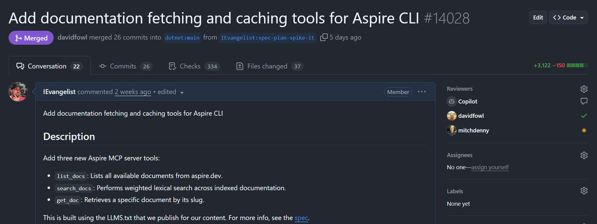

I know, I know—you're probably not in the mood for another AI post. Trust me, this one delivers.

This is the story of how a candid conversation with my long-time mentor turned into three new tools that fundamentally change how AI agents understand Aspire.

## 💬 The conversation that started it all

David Fowler has always been direct with me—which I've come to not only expect but genuinely adore.

We were in the midst of a rebrand, replatforming docs, and reimagining Aspire for what felt like the 13<sup>th</sup> time. During one of our conversations, I was explaining how we could improve the developer experience when building Aspire apps with AI assistance. That's when we discovered the real problem.

:::davidfowler
Plan it.
:::

:::davidfowler{align=left}
Spec it.
:::

:::davidfowler
Spike it.
:::

:::davidpine
Say less. 👇

> I literally created a GitHub branch named `plan-spec-spike-it` to capture the idea 🤓.



For the spec, see [mcp-docs-search.md](https://github.com/dotnet/aspire/blob/main/docs/specs/mcp-docs-search.md).
:::

## 🤔 The problem: AI doesn't know where to look

When developers rely on AI to help build Aspire apps, something frustrating kept happening.

The AI would recommend generic .NET patterns. It would reference `learn.microsoft.com` for documentation. It would suggest `dotnet run` instead of `aspire run`. It would recommend outdated NuGet packages. It would hallucinate APIs that don't exist. FFS 🤬!

Why? Because we were ".NET Aspire" far longer than we've been just "Aspire." LLMs are trained on historical data, and they're slow to catch up. The models learned .NET Aspire patterns: the .NET CLI, learn.microsoft.com, the old conventions. Now that we're simply **Aspire** with **aspire.dev** as our documentation home, we needed to teach them the new way.

:::note
I actually registered and indexed aspire.dev on [Context7](https://context7.com) so I could use their MCP server. It worked, but the tooling felt clunky. We could do better—and we did.
:::

## 💡 The solution: feed the AI real docs

The answer was staring us in the face.

We needed to surface Aspire documentation directly to AI agents through the Aspire MCP (Model Context Protocol) server. Not just links—the actual content, indexed and searchable. So I wrote three new tools:

- **`list_docs`**: Lists all available documents from aspire.dev
- **`search_docs`**: Performs weighted lexical search across indexed documentation
- **`get_doc`**: Retrieves a specific document by its slug

These tools solve a real problem: feeding LLMs meaningful guidance grounded in official documentation.

## 🦸 Standing on the shoulders of llms.txt

Here's where it gets interesting.

Since day one, aspire.dev has shipped with `llms.txt` support—thanks to an amazing Starlight maintainer, [Chris Swithinbank (delucis)](https://github.com/delucis). His [`starlight-llms-txt`](https://github.com/delucis/starlight-llms-txt) plugin follows the official [llms.txt specification](https://llmstxt.org/) and generates LLM-friendly documentation during the site build process.

The llms.txt spec is brilliant in its simplicity:

- A standardized `/llms.txt` markdown file for LLM consumption
- Brief background information, guidance, and links to detailed content
- A format that's both human-readable and machine-parseable

We configure a few pages to ignore, and from there it's off to the races. The result? A curated, LLM-friendly version of our docs at `aspire.dev/llms-small.txt`.

## 🏗️ The architecture

Let me walk you through how this all works.

### Tools

- **`list_docs`**: Lists all available documentation
- **`search_docs`**: Performs weighted lexical search
- **`get_doc`**: Retrieves specific document by slug

### Services

- **`IDocsFetcher`**: HTTP client for aspire.dev docs with ETag
- **`IDocsCache`**: IMemoryCache wrapper with ETag storage
- **`IDocsIndexService`**: Pre-indexing and weighted lexical search
- **`IDocsSearchService`**: High-level search API

### Parsers

- **`LlmsTxtParser`**: Async parallel parser for llms.txt format

### ⚙️ How it works

1. **Eager indexing**: When the MCP server starts, it immediately begins fetching and indexing aspire.dev documentation in the background—usually before the user even makes a request.
2. **ETag-based caching**: The fetcher uses HTTP ETags for conditional requests—no re-downloading unchanged content.
3. **Weighted lexical search**: Documents are scored using field weights (titles weighted 10x, summaries 8x, headings 6x, code 5x).
4. **Zero external dependencies**: No embedding provider needed. Pure lexical search that just works.

### 🔤 Why lexical search over embeddings?

Embeddings are costly upfront. We may revisit them later to improve recall, but for now, lexical search nails the use cases we care about.

Queries are:

- **Term-driven**: "connection string", "workload identity"
- **Section-oriented**: "configuration", "examples"
- **Name-exact**: "Redis resource", "AddServiceDefaults"

When someone asks about `AddPostgresContainer`, they mean _exactly_ that method name. Embeddings get fuzzy. Lexical search nails it.

## ✨ The impact on UX

This [pull request](https://github.com/dotnet/aspire/pull/14028) fundamentally changes how AI agents help developers.

### Before
- ❌ AI recommends `dotnet run` 
- ❌ AI suggests outdated NuGet packages
- ❌ AI references learn.microsoft.com for Aspire
- ❌ AI hallucinates non-existent APIs

### After  
- ✅ AI recommends `aspire run`
- ✅ AI knows current package versions from docs
- ✅ AI references aspire.dev as the source of truth
- ✅ AI provides correct, documented API usage

## 🔧 The tools in action

### `list_docs`

Lists all available documents from aspire.dev. No parameters required.

```json
{
  "type": "object",
  "properties": {},
  "additionalProperties": false,
  "description": "Lists all available documentation from aspire.dev. No parameters required."
}
```

### `search_docs`

Performs weighted lexical search across indexed documentation. Pass a query, get ranked results back.

```json
{
  "type": "object",
  "properties": {
    "query": {
      "type": "string",
      "description": "The search query to find relevant documentation."
    },
    "topK": {
      "type": "integer",
      "description": "Number of results to return (default: 5, max: 20)."
    }
  },
  "required": ["query"]
}
```

### `get_doc`

Retrieves a specific document by its slug. Matching is case-insensitive, and you get the full document content.

```json
{
  "type": "object",
  "properties": {
    "slug": {
      "type": "string",
      "description": "The document slug (URL-friendly identifier)."
    }
  },
  "required": ["slug"]
}
```

:::tip[Try it yourself]
Once you're up and running with the Aspire MCP server, configuring VS Code is simple:

```json title="./vscode/mcp.json"
{
  "servers": {
    "aspire": {
      "type": "stdio",
      "command": "aspire",
      "args": ["agent", "mcp"]
    },
  }
}
```
:::

## 🔬 Implementation details

The weighted search scoring is carefully tuned.

| Field | Weight |
|-------|--------|
| Title (H1) | 10.0x |
| Summary | 8.0x |
| Section Heading | 6.0x |
| Code blocks | 5.0x |
| Body text | 1.0x |

Additional scoring bonuses:
- Word boundary match: +0.5
- Multiple occurrences: +0.25 per occurrence (max 3)
- Code identifier match: +0.5

The parser uses `ReadOnlySpan<char>` for zero-allocation parsing and `ArrayPool<char>` for slug generation. Performance matters when you're indexing documentation at startup.

:::warning[A known limitation]
This architecture is **destructive**. The parsed llms.txt content doesn't preserve links back to the original source pages on aspire.dev. Users (and agents) can't easily navigate to the canonical documentation URL. Mapping slugs to a parsed `sitemap.xml` could solve this—food for thought for a future iteration.
:::

## 🧩 Beyond MCP: reusable services

Here's the thing—we built a very small amount of MCP-specific code. For the most part, we built **reusable services** that happen to be exposed through MCP.

The `IDocsIndexService`, `IDocsSearchService`, `IDocsFetcher`, and `IDocsCache` are all standalone abstractions. They understand how to fetch, parse, cache, and search aspire.dev documentation. The MCP tools are just one consumer.

This opens up possibilities:

- **CLI command**: `aspire docs search "redis caching"` could query the same index
- **AI skills**: Semantic Kernel or AutoGen agents could use these services directly
- **IDE extensions**: A VS Code extension could surface doc search without leaving the editor
- **Build-time validation**: Verify that code samples reference documented APIs

The architecture is intentionally decoupled. Today it's MCP. Tomorrow it could be anything that needs programmatic access to Aspire documentation.

## 📊 Architecture diagrams

Let's break down the architecture into digestible pieces.

import Mermaid from '../../../components/Mermaid.astro';

### Request flow

Here's what happens when an AI agent uses the docs tools:

<Mermaid alt="Request flow: AI Agent calls search_docs on the Aspire MCP server, which queries the DocsIndexService. On a cache miss, docs are fetched from aspire.dev with ETag support; on a hit, cached docs are returned." chart={`
sequenceDiagram
    actor Agent as AI Agent
    participant MCP as Aspire MCP
    participant Index as DocsIndexService
    participant Cache as DocsCache
    participant Web as aspire.dev

    Agent->>MCP: search_docs("redis")
    MCP->>Index: Search(query)
    
    alt Cache miss or stale
        Index->>Cache: TryGetDocs()
        Cache-->>Index: null
        Index->>Web: GET /llms-small.txt
        Web-->>Index: 200 OK + ETag
        Index->>Cache: Store(docs, etag)
    else Cache hit
        Index->>Cache: TryGetDocs()
        Cache-->>Index: Cached docs
    end
    
    Index-->>MCP: Ranked results
    MCP-->>Agent: Documentation matches
`} />

### Tools → services

The tools use different services based on their needs:

<Mermaid alt="Tools to services mapping: list_docs and get_doc connect to IDocsIndexService, search_docs connects to IDocsSearchService which also uses IDocsIndexService." chart={`
flowchart LR
    ListDocs["list_docs"] --> Index["IDocsIndexService"]
    SearchDocs["search_docs"] --> Search["IDocsSearchService"]
    GetDoc["get_doc"] --> Index
    Search --> Index
`} />

### Fetching and parsing

The index service coordinates fetching from aspire.dev and parsing the LLMS.txt format:

<Mermaid alt="Fetching and parsing flow: IDocsIndexService coordinates IDocsFetcher and LlmsTxtParser, with IDocsFetcher retrieving content from aspire.dev/llms-small.txt." chart={`
flowchart LR
    Index["IDocsIndexService"] --> Fetcher["IDocsFetcher"]
    Index --> Parser["LlmsTxtParser"]
    Fetcher --> AspireDev["aspire.dev/llms-small.txt"]
`} />

### Caching with ETags

The fetcher uses HTTP ETags to avoid re-downloading unchanged content:

<Mermaid alt="Caching with ETags: IDocsFetcher uses IDocsCache backed by IMemoryCache, and sends conditional If-None-Match requests to aspire.dev which may return 304 Not Modified." chart={`
flowchart LR
    Fetcher["IDocsFetcher"] --> Cache["IDocsCache"]
    Cache --> Memory["IMemoryCache"]
    Fetcher -.->|"If-None-Match"| Web["aspire.dev"]
    Web -.->|"304 Not Modified"| Fetcher
`} />


## 🔮 What's next?

This is just the beginning.

Future considerations include:

- **Full documentation support**: Currently using `llms-small.txt` for abridged docs—could add `llms-full.txt` for comprehensive documentation.
- **Sitemap integration**: Use `sitemap.xml` to discover all docs pages for more complete indexing, and map slugs back to aspire.dev URLs.
- **Disk persistence**: Serialize parsed documents to disk for faster startup.
- **Search improvements**: TF-IDF or BM25 for more sophisticated ranking, plus fuzzy matching for typo tolerance.

## 🎬 Wrapping up

Sometimes the best solutions come from recognizing what's already there. We had LLMS.txt. We had the MCP server. We just needed to connect them.

Thanks to David Fowler for the direct feedback that sparked this work, and to Chris Swithinbank for the incredible `starlight-llms-txt` plugin that makes it all possible. If you're using AI to build Aspire apps, these tools should make your experience noticeably better.

The AI now has access to the same documentation you do—and it knows to use it.

Check out the [full pull request on GitHub](https://github.com/dotnet/aspire/pull/14028).

---

*Happy coding, friends!* 🚀
