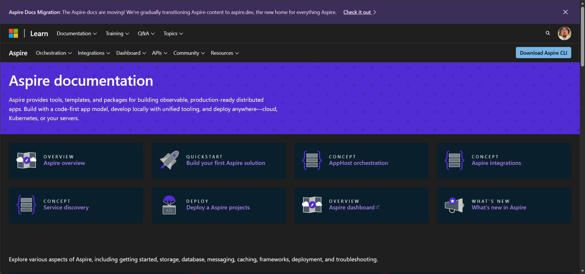
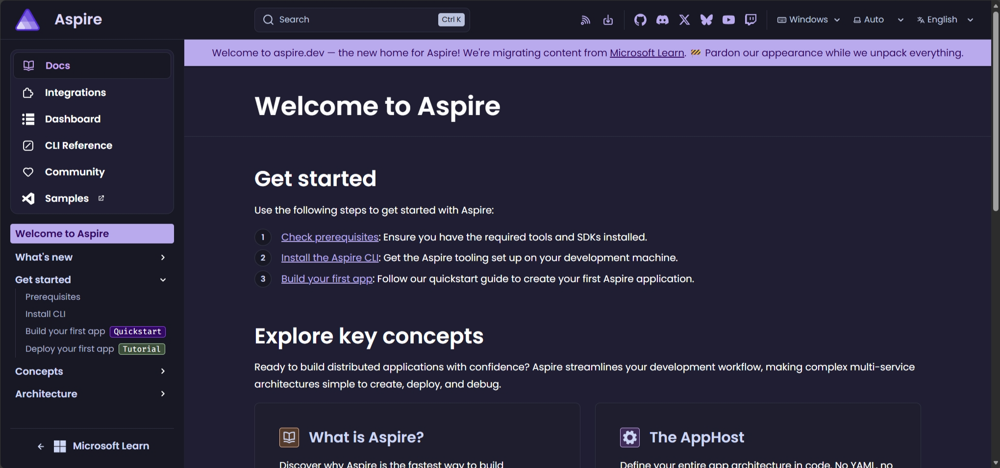
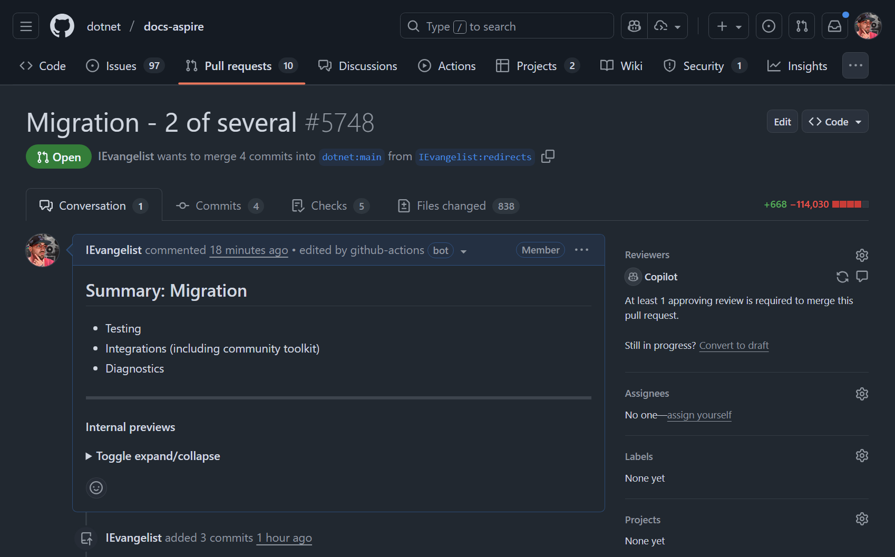

When my team (the Aspire team) decided to migrate all Aspire content from Microsoft Learn to the shiny new [aspire.dev](https://aspire.dev) site, we knew we'd signed up for a marathon. You may have noticed banners atop both Microsoft Learn: Aspire and aspire.dev announcing the migration...

[**Microsoft Learn: Aspire**](https://learn.microsoft.com/dotnet/aspire/)

[**aspire.dev: Welcome page**](https://aspire.dev/get-started/welcome/)

The initial estimate? **Three months** of dedicated work—an entire corporate quarter of toil. Picture this: hundreds of published articles, each one demanding careful surgery to convert syntax, restructure directories, update messaging, revamp layouts, adapt to new tooling, and genuflect to new conventions.

Yeah, no thanks. Then I discovered GitHub Copilot's **Plan** mode in VS Code 🤓.

:::copilot
I can help you create a comprehensive migration plan. Let me break this down into manageable steps:

1. First, let's document all the syntax transformations needed
2. Create a reusable prompt file to ensure consistency
3. Process files in logical batches for easier review
4. Convert DocFX-specific elements to your custom Astro components

Would you like me to start by analyzing a sample file to identify all the patterns we need to handle? I can then generate a migration plan that covers syntax changes, metadata updates, and component replacements.
:::

## Enter planning mode

GitHub Copilot's [Planning mode](https://code.visualstudio.com/docs/copilot/chat/chat-planning) fundamentally changed the game. Instead of manually editing each file (soul-crushing), or wrestling with some other AI tool that kept hallucinating nonsense (equally soul-crushing), I could formalize a comprehensive plan that spelled out:

- **Syntax changes**: Converting from Microsoft Learn's documentation format to the new aspire.dev conventions, using MDX, custom Astro components, and Starlight design system elements
- **Directory updates**: Reorganizing file structures to match the new site architecture  
- **Convention alterations**: Ensuring consistency across all integration documents
- **Metadata transformations**: Updating front matter and document properties
- **Component migration**: Replacing DocFX-specific syntax (like zone pivots and image directives) with custom Astro & Starlight components—specifically the `PivotSelector` and `Pivot` components I built for the new site
- **Domain knowledge encoding**: Translating my deep understanding of both the old and new documentation systems into a prompt (plan) that could be iteratively refined and executed

This wasn't just a simple find-and-replace operation—if only. We were fundamentally rearchitecting how we write docs, migrating from DocFX with markdown to a modern Astro & Starlight stack. The secret sauce? Encoding my domain knowledge—every quirk, pattern, and gotcha from both systems—into a plan that the AI could execute consistently across hundreds of files.

The beauty of Planning mode is its ability to transform impossible into manageable. You break down massive tasks into bite-sized, reviewable steps, then execute them systematically. Applying first principles thinking, I treated this migration as a series of transformations, each with crystal-clear input and output expectations.

Normally, I'd label this "busy work"—that special brand of mundane, repetitive, mind-numbing tedium that makes you question your career choices. I have better things to do, like actually building features or, you know, enjoying coffee. But with AI assistance? Suddenly this tedious slog transformed into a high-leverage activity worthy of my time.

## The execution

The migration happened across a series of pull requests, but the crown jewel was [Pull Request #49](https://github.com/microsoft/aspire.dev/pull/49)—the bulk migration of all integrations, community toolkit integrations, and diaganostics documentation from Microsoft Learn to aspire.dev. Think of it as moving an entire library across town, except every book needs to be rewritten in a new language while maintaining the same story.

This wasn't just a typical pull request. The diff tells the story:

- **+18,558 lines added**
- **−1,995 lines removed**

We're talking about transforming nearly 20,000 lines of documentation in a single, coherent pull request. The added lines represent the new MDX format with custom Astro components, while the removed lines were the old DocFX markdown being shown the door.

But that single PR was just one chapter of the story. The complete migration spanned multiple pull requests, each tackling different aspects of the documentation ecosystem. When you zoom out and look at the total impact across all related PRs, the numbers become even more staggering:

- **+668 lines added** across supporting changes
- **−114,030 lines removed** from the source repository

Yes, you're reading that correctly: [over **114,000 lines deleted**](https://github.com/dotnet/docs-aspire/pull/5748).

:::tip{title="➕ Understanding the deltas"}

The massive deletion count reflects more than just content migration. We also removed entire snippet directories that were previously referenced as raw code blocks within the docs-aspire content. This approach allowed us to run compilation of the code—a nice-to-have feature that validated our examples. We'll evaluate implementing a similar compilation validation system in aspire.dev at some future point.

:::

### By the numbers

To understand the scale of this migration, here's what we were working with in the source repository:

| Category | Count | Notes |
|----------|-------|-------|
| **Markdown files (articles)** | 352 | The primary documentation content |
| **YAML files** | 42 | Configuration and metadata files |
| **Images** | 353 | 332 PNG, 15 SVG, 6 GIF |
| **C# projects** | 153 | Sample code and integration examples |
| **Total files** | 3,857 | Complete repository inventory |

The repository was a sprawling ecosystem of documentation, code samples, and assets. Beyond the core docs:

- **348** C# source files
- **151** Razor components  
- **120** CSS files
- **46** Bicep templates
- **45** solution files
- And **28 more file types** scattered about

:::note{title="🤯 These stats brought to you by, GitHub Copilot CLI"}

A simple query on the command line using GitHub Copilot CLI helped tally up the file types and counts. Instead of writing some ellaborate script, I simply asked Copilot to break down the totals based on a commit that represented the pre-migration state of the repository. It figured out the rest, but basically checked out the repo at that commit, scanned the file system, and produced a neat summary of file types and counts.

:::

Not every file needed migration—compiled binaries and build artifacts got to sit this one out—but even focusing solely on documentation and supporting files meant tackling a Herculean task. **Over 350 articles** demanded careful conversion, each one a special snowflake with its own syntax quirks, metadata peculiarities, and structural idiosyncrasies.

Every single integration was successfully migrated in a fraction of the anticipated time. What would have been three months of drudgery became one intense, productive day.

## The power of context switching

Here's where things get genuinely impressive: AI-assisted development freed me from the tyranny of continuous focus. I spent a full day on this migration, but I wasn't shackled to my desk like some modern-day Prometheus. Instead, I could:

1. **Set up the plan** and let Copilot churn through a batch of files
2. **Step away** for meetings, coffee, or existential contemplation
3. **Return and review** the changes at my leisure
4. **Course-correct** and refine the approach when needed
5. **Repeat** until victory

The AI didn't lose its place or forget what it was doing. The plan remained rock-solid consistent, and I could "tame" the AI whenever it started wandering off into creative territory (read: making stuff up).

### AI everywhere

Look, I'll be honest—AI has become an integral part of my development workflow. GitHub Copilot isn't just a tool; it's genuinely everywhere I work:

- **[GitHub Copilot CLI](https://docs.github.com/en/copilot/github-copilot-in-the-cli/about-github-copilot-in-the-cli)**: For those command-line flags I can never remember, and powerful file system searches when Windows Explorer claims something doesn't exist (spoiler: it does)
- **[GitHub.com's Copilot](https://docs.github.com/en/copilot/how-tos/use-copilot-agents/manage-agents)**: For constructive and valuable code reviews, and pull requests that often do as you ask
- **[VS Code's Copilot Agent](https://code.visualstudio.com/docs/copilot/copilot-coding-agent) and [Planning modes](https://code.visualstudio.com/docs/copilot/chat/chat-planning)**: For breaking down complex tasks into manageable steps

It's not just assistance—it's like having a tireless colleague who's always ready to help, never complains, and can process thousands of files without breaking a sweat. The "Copilot" branding? Spot on. 🤖

## Lessons learned

**Start with a solid plan**: The `.github/prompts/update-integrations.prompt.md` file became my north star, my constitution, my single source of truth. Time invested upfront documenting the migration requirements paid dividends throughout—like compound interest, but for productivity.

**Review in batches**: Don't try to boil the ocean. I broke the work into logical groups of integrations, making the review process actually manageable instead of overwhelming. This approach caught issues early, when they were cheap to fix.

**Trust but verify**: AI is incredibly powerful, almost magical even, but human oversight remains non-negotiable. In my experience, about 90% of the migrations were perfect, with the remaining 10% needing minor touch-ups. Those are excellent odds, but that 10% matters.

**Document your process**: By capturing the prompt and approach in the repository itself, we've created a reusable template for future migrations or similar large-scale updates. Future you (or future colleagues) will thank present you.

## From three months to a few days

Let that sink in for a moment: **three months compressed into a few partial days**. The contrast isn't just striking—it's borderline absurd. But this isn't merely a speed story. It's about maintaining consistency across hundreds of documents, reducing human error to near-zero, and liberating valuable engineering time for work that actually requires human creativity and strategic thinking.

GitHub Copilot's Planning mode didn't just make me faster; it made the entire migration more reliable, more maintainable, and frankly, more sane. As we continue evolving aspire.dev, having this documented approach means we can confidently tackle site-wide changes without inducing existential dread.

## The bigger picture

The future of developer productivity isn't just about AI writing code—that's table stakes. It's about AI helping us plan, execute, and manage large-scale transformations with unprecedented efficiency. It's about turning the tedious into the tractable, the impossible into the inevitable.

This migration proved something important: with the right tools and approach, we can accomplish in hours what used to take months. The question isn't whether AI will transform how we work—it already has. The question is: what will you build with all that newfound time?

The journey doesn't end here—it's just beginning. I'm building aspire.dev in the open, and this migration is merely chapter one of a much larger story. Every contribution, every improvement, every lesson learned becomes part of our collective knowledge.

Want to be part of shaping the future of Aspire documentation? The doors are wide open, the tools are evolving, and there's room at the table for everyone who shares our vision of making cloud-native development more accessible, more powerful, and more delightful.

Together, we're not just building documentation—we're building the foundation for how developers will understand and leverage distributed applications for years to come.

[Join us: Contributor guide for `aspire.dev`](https://aspire.dev/community/contributor-guide)
