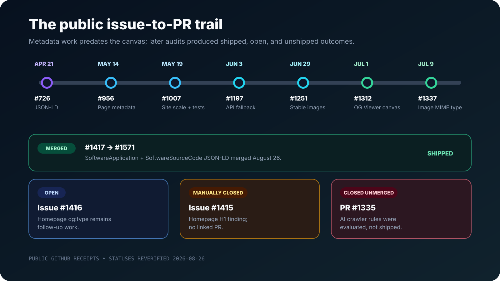

**Open Graph SEO** was one part of a broader discoverability program on Aspire.dev. After we improved structured data, page-specific social metadata, image handling, and regression checks, I later observed total site traffic at roughly **four times** its earlier level in our 1DS/Azure Monitor telemetry.

That result is exciting, but the caveat matters: this was a qualitative, first-hand observation of **total traffic**. It was not a Search Console comparison, an isolated organic-search measurement, or a controlled experiment. The public engineering trail shows that the work shipped before the increase. It does not prove that Open Graph metadata alone caused it.

What it does give us is a useful case study: a generic social card became a measurable, site-wide metadata system; that system gained tests and a purpose-built Copilot tool; and the site later reached a much larger audience.

## What the OpenGraph preview tool does

I built the **OG Viewer** as a canvas for the GitHub Copilot app. Give it a public URL or a `localhost` address and it can:

- preview how the page will appear across multiple social platforms;
- expose the raw Open Graph and Twitter metadata behind those cards;
- diagnose metadata and agent-readiness gaps; and
- turn a concrete finding into Copilot work or a GitHub issue.

That shortens the loop between seeing a weak preview and creating actionable engineering work. It also helps me inspect the metadata itself instead of trusting that an attractive card means every field is correct.

I already wrote the implementation story in [Building an OpenGraph preview canvas for GitHub Copilot](/posts/opengraph-preview-canvas/), including the architecture, tab walkthrough, safety model, and source tour. I will not repeat those details here. The [extension is open source in `microsoft/aspire.dev`](https://github.com/microsoft/aspire.dev/tree/main/.github/extensions/og-preview), and GitHub documents how to [work with canvas extensions](https://docs.github.com/en/copilot/how-tos/github-copilot-app/working-with-canvas-extensions).

## The work started with a generic card

The concrete before-state is documented in [issue #507](https://github.com/microsoft/aspire.dev/issues/507). Every Aspire docs page inherited the same title, description, and social image. Sharing the homepage, a tutorial, or a deep API article produced essentially the same card.

That was more than a cosmetic problem:

| Before                                         | After                                             |
| ---------------------------------------------- | ------------------------------------------------- |
| One generic identity for every route           | Page-specific Open Graph and Twitter metadata     |
| Shared links gave readers little context       | Titles and descriptions explained the destination |
| One static image represented unrelated content | Dynamic cards reflected each page                 |
| Metadata quality depended on manual review     | Tests guarded title and description quality       |

Page-specific Open Graph metadata improves the handoff between a page and the places where people discover it. A useful title, description, image, and image alt value make a shared link more understandable, accessible, and credible. They also create a maintainable contract instead of a pile of route-specific exceptions.

This work sat beneath a broader objective I opened in [issue #18](https://github.com/microsoft/aspire.dev/issues/18): make targeted improvements so Aspire could capture more of the interest already forming around the product. That umbrella issue was later manually closed as completed; it was a program of work, not one traceable code change. It also followed [the move to aspire.dev](/posts/aspire-dot-dev/), which gave us a focused home to improve.

## The public issue-to-PR trail

The strongest evidence is the repository history. Each receipt below has a different status, and those distinctions matter. Merged work reached the codebase. Open issues remain follow-up work. A manually closed issue does not, by itself, prove that a fix shipped. A closed-unmerged PR records an evaluated proposal, not production behavior.

| Date      | Receipt                                                                                                                            | Outcome                                                                       |
| --------- | ---------------------------------------------------------------------------------------------------------------------------------- | ----------------------------------------------------------------------------- |
| April 21  | [Issue #681](https://github.com/microsoft/aspire.dev/issues/681) → [PR #726](https://github.com/microsoft/aspire.dev/pull/726)     | **Merged:** JSON-LD for docs page types                                       |
| May 14    | [Issue #507](https://github.com/microsoft/aspire.dev/issues/507) → [PR #956](https://github.com/microsoft/aspire.dev/pull/956)     | **Merged:** page-specific Open Graph/Twitter metadata and dynamic images      |
| May 19    | [PR #1007](https://github.com/microsoft/aspire.dev/pull/1007)                                                                      | **Merged:** site-wide metadata optimization and regression guards             |
| June 3    | [PR #1197](https://github.com/microsoft/aspire.dev/pull/1197)                                                                      | **Merged:** generated API-reference image fallback                            |
| June 29   | [PR #1251](https://github.com/microsoft/aspire.dev/pull/1251)                                                                      | **Merged:** stable sample-page social-image URLs                              |
| July 1    | [PR #1312](https://github.com/microsoft/aspire.dev/pull/1312)                                                                      | **Merged:** OpenGraph preview canvas                                          |
| July 9    | [PR #1337](https://github.com/microsoft/aspire.dev/pull/1337)                                                                      | **Merged:** image MIME metadata                                               |
| July 21   | [PR #1335](https://github.com/microsoft/aspire.dev/pull/1335)                                                                      | **Closed unmerged:** explicit AI crawler rules were evaluated but not shipped |
| August 19 | [Issue #1415](https://github.com/microsoft/aspire.dev/issues/1415)                                                                 | **Manually closed:** homepage H1 finding, with no linked PR                   |
| Open      | [Issue #1416](https://github.com/microsoft/aspire.dev/issues/1416)                                                                 | **Open:** homepage still emits `og:type=article` instead of `website`         |
| August 26 | [Issue #1417](https://github.com/microsoft/aspire.dev/issues/1417) → [PR #1571](https://github.com/microsoft/aspire.dev/pull/1571) | **Merged:** homepage `SoftwareApplication` and `SoftwareSourceCode` JSON-LD   |

These statuses were reverified on August 26, 2026. PR #1571 is the notable change from the original research: it merged that day, and issue #1417 closed as completed.

### Make pages machine-readable

[PR #726](https://github.com/microsoft/aspire.dev/pull/726) established a JSON-LD foundation for docs pages. This is related to Open Graph work, but it solves a different problem. Open Graph describes how a link should appear when shared. Schema.org structured data helps machines understand the entities and relationships represented by the page.

Both support discoverability, but neither should be turned into a magical ranking claim. The practical goal was to make the site clearer to people, social platforms, search systems, and agents. That same motivation later shaped [how AI reads the Aspire docs](/posts/aspire-docs-mcp-tools/).

### Give every page its own social identity

[PR #956](https://github.com/microsoft/aspire.dev/pull/956) resolved the generic-card problem with page-specific Open Graph and Twitter metadata plus dynamic Open Graph images. Five days later, [PR #1007](https://github.com/microsoft/aspire.dev/pull/1007) widened the scope from infrastructure to the content itself.

That follow-up introduced a dedicated `seoTitle` override, routed every English docs page through shared metadata resolution, rewrote frontmatter at scale, and added SEO regression tests. This is where the effort became a system rather than a one-time visual refresh.

### Harden the image pipeline

Real sites have generated routes and build pipelines, so image correctness required follow-through.

[PR #1197](https://github.com/microsoft/aspire.dev/pull/1197) fixed the fallback image used by generated API-reference pages. [PR #1251](https://github.com/microsoft/aspire.dev/pull/1251) replaced hashed sample-page image paths with stable URLs that social crawlers could resolve. [PR #1337](https://github.com/microsoft/aspire.dev/pull/1337) added `og:image:type`, making the image's MIME type explicit.

These are small changes individually. Together they make dynamic social metadata more dependable for crawlers that do not execute or interpret a site exactly like a browser.

### Productize the feedback loop

[PR #1312](https://github.com/microsoft/aspire.dev/pull/1312) merged the OpenGraph preview canvas on July 1. The chronology is important: the JSON-LD work, page-specific metadata, site-scale optimization, and several image fixes **predated** the canvas.

The canvas did not cause those earlier PRs. It packaged what I had learned into a faster, repeatable workflow and supported later audits. Instead of juggling source, browser tools, platform validators, and issue forms, I could move from page to evidence to action inside Copilot.

### Keep auditing after the first win

Later diagnostics found more work. [Issue #1415](https://github.com/microsoft/aspire.dev/issues/1415) flagged a brand-only homepage H1. It was manually closed without a linked PR, so I cannot point to it as evidence of a shipped fix. [Issue #1416](https://github.com/microsoft/aspire.dev/issues/1416), which says the homepage should emit `og:type=website`, remains open.

[Issue #1417](https://github.com/microsoft/aspire.dev/issues/1417) had a different outcome: [PR #1571](https://github.com/microsoft/aspire.dev/pull/1571) merged richer software and source-code JSON-LD on August 26. Meanwhile, [PR #1335](https://github.com/microsoft/aspire.dev/pull/1335) proposed explicit AI crawler rules but closed unmerged. That idea was evaluated; it is not part of the shipped site behavior.

An honest case study includes those loose ends. SEO work is a maintained system, not a victory screen.

## What changed at site scale

[PR #1007](https://github.com/microsoft/aspire.dev/pull/1007) supplies the clearest quantitative engineering receipts:

| Measure                                       | Recorded result |
| --------------------------------------------- | --------------: |
| English-page frontmatter rewrites             |     Roughly 280 |
| Optimal composed social titles                |  56 → 212 pages |
| Optimal descriptions                          | 223 → 403 pages |
| English pages passing the new CI guard        |             467 |
| Focused metadata tests at the time            |      52 passing |
| Pages generated by the full build at the time |          12,271 |

The PR defines an optimal composed title as 50–60 characters and an optimal description as 110–160 characters. Its targeted test command reported 52 passing tests: 49 page-metadata tests and three SEO-guard tests. The full build generated 12,271 pages with valid internal links at that point in time.

Those numbers describe coverage and verification, not traffic attribution. The durable value came from the mechanisms behind them: `seoTitle`, shared metadata resolution, dynamic cards, frontmatter improvements, and CI guards that could catch drift after the large Open Graph metadata audit was over.

## Then total traffic reached roughly 4x

> After the broader metadata and SEO rollout, I observed total Aspire.dev traffic at roughly four times its earlier level.

I saw that change first-hand in Aspire's 1DS/Azure Monitor telemetry. I am deliberately describing it qualitatively. I am not publishing the private telemetry, recreating a chart from memory, inventing exact dates, or attaching raw counts that are not part of this public evidence trail.

Most importantly, the measured value was **total traffic**. It was not Google Search Console clicks, and it was not a clean organic-search segment. Total traffic can include direct visits, referrals, social sharing, product interest, documentation links, release activity, and other channels.

Why include the observation at all? Because engineering teams often stop at metadata correctness. We verify tags, merge the PR, and move on. The later traffic level is a reason to keep watching outcomes after the technical work ships, even when the available observation cannot isolate one channel or one intervention.

The public receipts substantiate the sequence and scale of the implementation. My telemetry observation adds first-hand experience. Keeping those evidence types separate makes the story more useful, not less.

## What the 4x result does and does not prove

Open Graph metadata is **not a direct Google ranking factor**. The [Open Graph protocol](https://ogp.me/) defines how a page represents itself as a rich object; it does not promise higher search rankings.

Better cards can still matter. Clear page-specific titles, descriptions, and images can improve how links communicate in social feeds, chat clients, issue trackers, and other referral surfaces. A more useful preview may earn a click that a generic card would not. Stable images and accurate accessibility metadata also make that distribution layer more trustworthy.

But the Aspire.dev program was broader than social cards:

- JSON-LD improved machine-readable entity information.
- Page frontmatter gained clearer titles and descriptions.
- Dynamic image and fallback behavior became more reliable.
- Tests protected metadata quality across hundreds of pages.
- Continued audits found homepage, schema, and agent-readiness gaps.

Product releases, growing brand interest, direct traffic, referrals, search visibility, and unrelated site changes are all plausible confounders. Without a controlled comparison or channel-level analysis, assigning the increase to one tag would be storytelling, not measurement.

The defensible conclusion is narrower: the work materially improved Aspire.dev's metadata foundation, made quality measurable, and preceded a large increase in total traffic. That is **temporal correlation across a broader discoverability program**, not proof that Open Graph alone generated a 4x ranking or traffic gain.

## A repeatable Open Graph testing workflow

The most useful outcome is a loop another developer can repeat:

1. **Preview the real page or `localhost`.** Start with the route people will share, not a generic homepage assumption. Issue #507 existed because deep pages all collapsed into one card.
2. **Inspect raw metadata.** A card can look acceptable while omitting image alt text, dimensions, MIME type, canonical URL, or Twitter fields. PR #1337 came from looking beyond the pixels to `og:image:type`.
3. **Turn one diagnostic into an issue.** Record the exact URL, observed metadata, expected output, and acceptance criteria. Issues #1415–#1417 show how specific findings can be tracked independently.
4. **Implement the smallest site-wide fix.** Prefer shared metadata resolution, a schema field, or a generated fallback over route-by-route patches. PRs #956, #1007, and #1197 each moved behavior into reusable infrastructure.
5. **Add a regression guard.** Define the quality boundary in code. PR #1007 made title and description coverage testable across all English pages instead of relying on a one-time spreadsheet or visual pass.
6. **Observe outcomes without overstating attribution.** Track previews, referrals, search data, and total traffic where available. Name the source and segment. If the data is total traffic, call it total traffic.

That loop is why I built the canvas. The visual preview gets attention, but the engineering value comes from connecting evidence to a fix and then protecting the fix from drift. Used that way, Open Graph SEO is not tag theater. It is a small, inspectable part of a healthy publishing system.

## Try the canvas and inspect the receipts

[Read how the OpenGraph canvas was built](/posts/opengraph-preview-canvas/), [watch the OG Viewer demo](/media/), inspect the [open-source extension](https://github.com/microsoft/aspire.dev/tree/main/.github/extensions/og-preview), and follow the linked issues and PRs above.

Then run the smallest useful experiment on your own site: preview one important page, fix one concrete diagnostic, and add one regression test.

## Frequently asked questions

### Does Open Graph metadata directly improve Google rankings?

No. Open Graph is not a direct Google ranking factor. It controls how links are represented across social and messaging surfaces. Better previews can improve clarity, distribution, referral click-through, and trust, while strong titles and descriptions may also be useful elsewhere in a broader SEO implementation.

### What did the 4x number measure?

It was my qualitative, first-hand observation of **total Aspire.dev traffic** in 1DS/Azure Monitor. It was not a published raw count, Search Console click comparison, or organic-search-only measurement.

### Did the OG Viewer cause every SEO change?

No. The public metadata work began before the canvas PR. The canvas productized and shortened the feedback loop, then supported later audits and follow-up work.

### Which tags should developers validate first?

Start with `og:title`, `og:type`, `og:url`, and `og:image`. Then verify `og:description`, image width, height, MIME type and alt text, plus `twitter:card`, `twitter:title`, `twitter:description`, and `twitter:image`.
